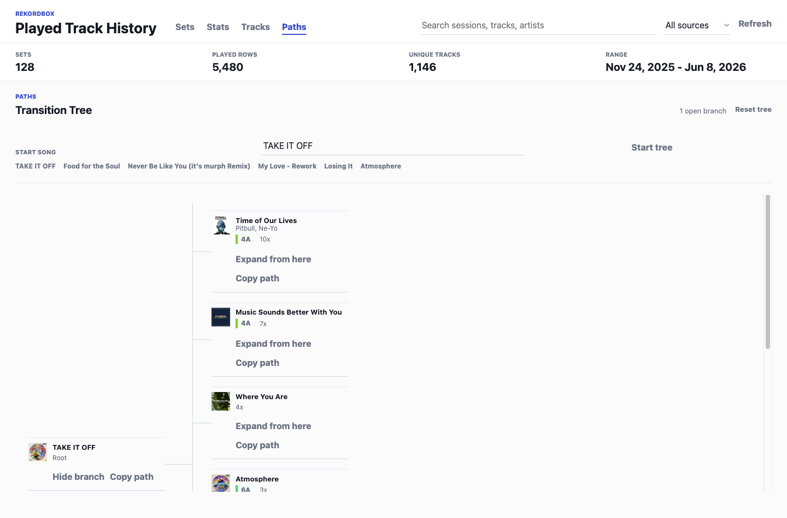

# Rekordbox History Viewer

Turn your Rekordbox play history into a clean desktop dashboard for sets, stats, and tracks.

## Download And Run

**Download the latest app here:** <https://github.com/axel-slid/rekordbox-history-viewer/releases/tag/v0.1.3>

Pick the file for your computer, unzip it if needed, then open the app. The first launch can take a few minutes because the app prepares a local Python reader and resolves Spotify track names into a local cache.

### Mac

1. Open the download link above.
2. Download `Rekordbox-History-Viewer-0.1.3-mac-apple-silicon.zip`.
3. Double-click the zip file. This creates the app.
4. Double-click `Rekordbox History Viewer`.
5. If macOS blocks it, right-click `Rekordbox History Viewer`, choose **Open**, then choose **Open** again.
6. If macOS says the app is damaged, open Terminal and run `xattr -dr com.apple.quarantine ~/Downloads/Rekordbox\ History\ Viewer.app`.
7. Leave the app open on first launch while it prepares the Rekordbox reader.

### Windows

1. Open the download link above.
2. Download `Rekordbox-History-Viewer-0.1.3-windows.zip`.
3. Right-click the zip file and choose **Extract All**.
4. Open the extracted folder.
5. Double-click `Rekordbox History Viewer.exe`.
6. If Windows SmartScreen warns you, choose **More info**, then **Run anyway**.
7. Leave the app open on first launch while it prepares the Rekordbox reader.

### Linux

1. Open the download link above.
2. Download `Rekordbox-History-Viewer-0.1.3-linux.AppImage`.
3. Right-click the file, open **Properties**, and allow it to run as a program.
4. Double-click the AppImage.
5. Leave the app open on first launch while it prepares the Rekordbox reader.

### What You Need Installed

- Rekordbox, with existing played-track history.
- Python 3. The app uses it locally to read Rekordbox's database.
- Internet access on first launch, so the app can install its local Rekordbox database reader.

Your library stays on your computer. The app reads your local Rekordbox database and does not upload your play history.

## If The App Download Does Not Work

Use the source-code fallback on macOS:

1. Click the green **Code** button on GitHub.
2. Click **Download ZIP**.
3. Unzip the folder.
4. Double-click `open_rekordbox_history.command`.
5. If macOS blocks it, right-click the file, choose **Open**, then choose **Open** again.

That launcher installs the app dependencies, prepares the Python Rekordbox reader, builds the app, and opens it.


## What It Shows

- **Sets:** dated sessions like `June 7th, 2026 Set`, with the tracks played in order.
- **Stats:** a GitHub-style activity heatmap, genre donut, total play time, average time per day, busiest day, top source, average BPM, and repeated tracks.
- **Tracks:** a searchable track library with unique tracks, play counts, last played time, Camelot-style key badges, BPM, length, source, and sorting.
- **Paths:** start from a song, expand a rightward branching tree of historical next-track choices, see color-coded Camelot keys, and copy any path from the root song.
- **Exports:** download a setlist or generate a text prompt for manually recreating a set.

## Screenshots

### Stats


### Sets


### Tracks


### Paths



## For Developers

```sh
npm install
npm run setup:python
npm run dev
```

Build the static renderer:

```sh
npm run build
```

Run the built Electron app:

```sh
npm start
```

Create packaged builds:

```sh
npm run dist
```

## How It Works

The Electron main process runs `scripts/extract_rekordbox_history.py`, which reads the local Rekordbox database at:

```text
~/Library/Pioneer/rekordbox/master.db
```

The renderer groups the raw played rows into:

- dated sets
- unique tracks
- activity stats
- genre summaries
- repeated-track rankings

Spotify metadata is cached locally in the app's user-data folder so personal lookup data does not get committed or uploaded.

## What It Cannot Do Yet

I originally tried to make the app recreate historical mixes automatically. Rekordbox history does not appear to save enough transition, effects, EQ, loop, or fader data to rebuild exact mixes, so the app can show the order of songs and export setlists, but it cannot recreate the actual transitions.

The current extractor is designed around local Rekordbox 6 database data on macOS. Windows/Linux builds are provided for the Electron shell, but non-macOS Rekordbox library paths may need follow-up work.
