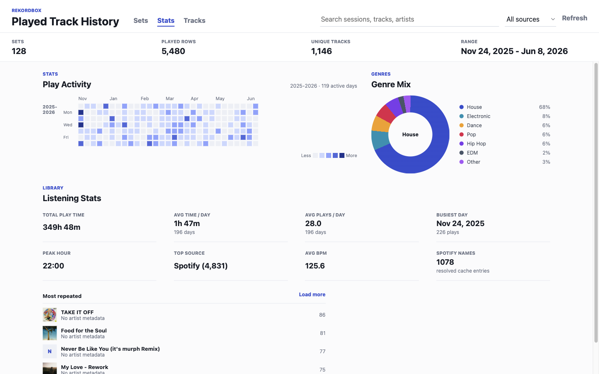
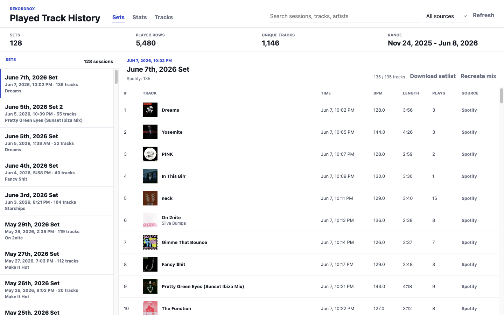
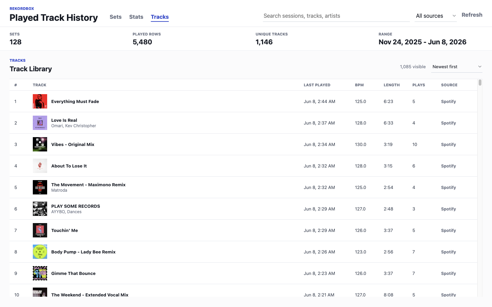

# Rekordbox History Viewer

A clean Electron app for browsing Rekordbox played-track history. It reads your local Rekordbox database, groups tracks into dated sets, resolves Spotify track names when possible, and shows stats like play activity, genre mix, total play time, average time per day, repeated tracks, and a full track library.



## What You Get

- **Sets:** every dated play session, named like `June 7th, 2026 Set`.
- **Stats:** GitHub-style play heatmap, genre donut, total play time, average time per day, busiest day, top source, average BPM, and most repeated tracks.
- **Tracks:** searchable unique track library with play counts, last played time, BPM, length, source, and sorting.
- **Export helpers:** download a setlist or generate a text prompt that explains how to recreate a mix manually.

## Download It The Easy Way

The easiest version is the downloadable app from GitHub Releases.

1. Open the **Releases** page for this repo.
2. Download the newest file for your computer:
   - Mac: `Rekordbox History Viewer-...-mac.zip`
   - Windows: `Rekordbox History Viewer-...-win.zip`
   - Linux: `Rekordbox History Viewer-...-linux...`
3. Unzip it.
4. Open **Rekordbox History Viewer**.
5. If macOS says the app is from an unidentified developer, right-click the app, choose **Open**, then choose **Open** again.

The app reads Rekordbox history from your own computer. It does not include anyone else's music library.

## If There Is No Release Yet

You can still use the app with very little terminal work on macOS:

1. Click the green **Code** button on GitHub.
2. Click **Download ZIP**.
3. Unzip the folder.
4. Double-click `open_rekordbox_history.command`.
5. If macOS blocks it, right-click the file, choose **Open**, then choose **Open** again.

That script installs the app dependencies, prepares the Python Rekordbox reader, builds the app, and opens it.

You only need:

- Rekordbox installed with existing play history.
- Node.js LTS from <https://nodejs.org>.
- Python 3 from <https://www.python.org/downloads/>.

## Screenshots

### Stats


### Sets



### Tracks



## For Developers

```sh
npm install
npm run setup:python
npm run dev
```

Build the static renderer:

```sh
npm run build
```

Run the built Electron app:

```sh
npm start
```

Create packaged builds:

```sh
npm run dist
```

## How It Works

The Electron main process runs `scripts/extract_rekordbox_history.py`, which reads the local Rekordbox database at:

```text
~/Library/Pioneer/rekordbox/master.db
```

The renderer then groups the raw played rows into:

- dated sets
- unique tracks
- activity stats
- genre summaries
- repeated-track rankings

Spotify metadata is cached locally in `data/spotify-track-cache.json`, which is ignored by git so personal lookup data does not get committed.

## Notes

- Rekordbox does not appear to save enough effect/transition automation data to recreate an exact DJ mix. The app can export a setlist and a recreation prompt, but it cannot perfectly rebuild effects, EQ moves, fader moves, loops, or transitions from Rekordbox history alone.
- The app is designed around local Rekordbox 6 database data on macOS. Windows/Linux builds are provided for the Electron shell, but the extractor path may need updates for non-macOS Rekordbox libraries.
